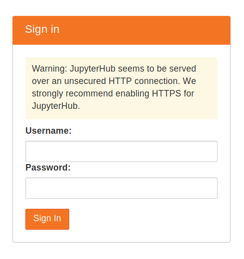

# Installing the littlest jupyterhub

1. Make sure you have python3, python3-dev, curl and git installed.```
sudo apt install python3 python3-dev git curl ```

2. Copy the text below, and paste it into the terminal. Replace <admin-user-name> with the name of the first admin user for this JupyterHub. Choose any name you like (don’t forget to remove the brackets!). This admin user can log in after the JupyterHub is set up, and can configure it to their needs. Remember to add your username! ``` curl -L https://tljh.jupyter.org/bootstrap.py | sudo -E python3 - --admin <admin-user-name> ```
3. Press Enter to start the installation process. This will take 5-10 minutes, and will say Done! when the installation process is complete
4. Copy the Public IP or campus IP of your server, and try accessing http://<public-ip/campus-ip> from your browser. If everything went well, this should give you a JupyterHub login page.
5. Login using the admin user name you used in step 3. You can choose any password that you wish. Use a strong password & note it down somewhere, since this will be the password for the admin user account from now on.
6. For more information see the official ["the littlest jupyterhub" docs](https://tljh.jupyter.org/en/latest/howto/index.html).


