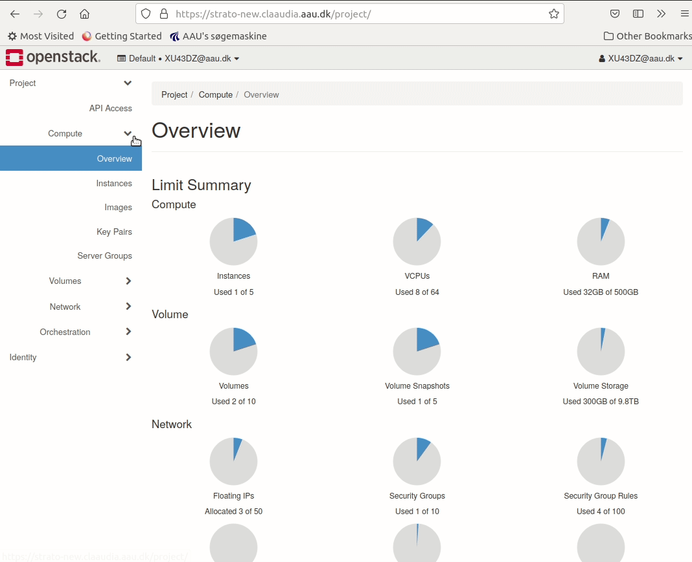
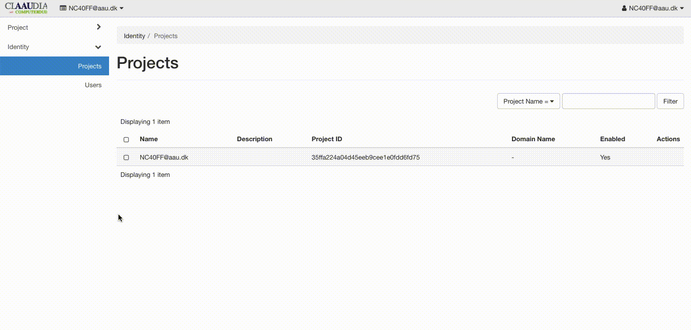

# Access to instance

Each instance has an internal fixed cloud IP address, but can also have a floating public IP address. An internal cloud IP addresses is used for communication between instances, and a floating public IP address is used for communication with networks outside the cloud, including the Internet.

### SSH rule

Most images is reached by SSH, which require port 22 open.

1. Navigate to **network**
2. Click the sub menu **Security Groups**
3. Click **Manage Rules** on the default Security group
4. Add a rule
5. Choose SSH from dropdown menu.



### Custom rule

Some services require different ports open. To achieve this, the user must create a custom security rule and add it the instance

1. Navigate to **network**
2. click the sub menu **Security Groups**
3. Create new **Security group**
4. Enter name & description
5. Add a rule with a custom port



## Key-pair

Openstack authenticates per default Linux instances with a ssh key-pair. If you have to access the machine with SSH, the key-pair must be set.  

1. Navigate to **Compute**
2. Click on the sub menu **Key Pairs**
3. Add new **Key Pair**
4. Fill out name
5. Save the public key locally


### SSH access to instance

You will have root-admin access to every instance you create and can therefore install additional software, tweak the instance or simply use it as is.
**Default username is *ubuntu*** for all instances. There is no default password. Use SSH keys for safety, otherwise you muse create a user, and set a secure password your self.

 ```bash
ssh ubuntu@130.226.98.xx -i yourPersonalKey.pem
 ```

