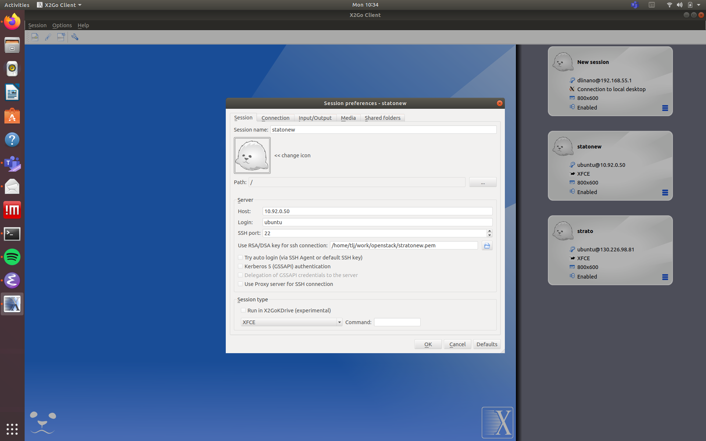
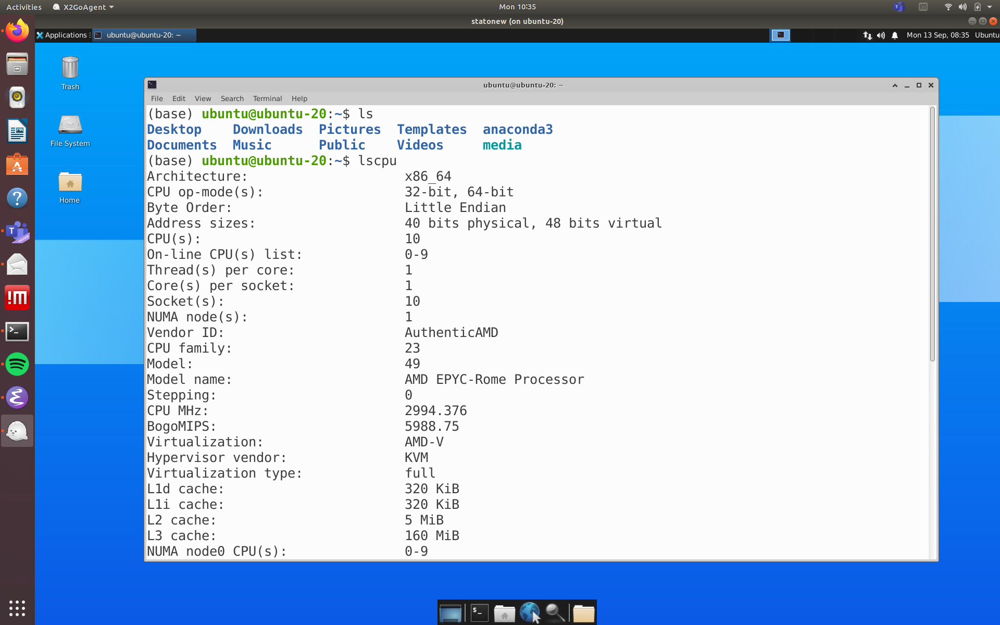

# Remote desktop using X2Go and Xfce

You might be interested in obtaining a GUI interface of you instances for directly visualizing results or using the GUI of your programs. In this guide we will show you how to do this using [X2Go](https://wiki.x2go.org/doku.php/doc:newtox2go) for remote desktop and the [Xfce desktop environment](https://www.xfce.org/). 

The main reason for using X2Go is that it allows for data traffic using SSH such we can use the existing infrastructure - the already open port on 22 for SSH and authentication using RSA keys.

Login to the instance using SSH and add x2go to the list of repositories

```bash
$ sudo add-apt-repository -y ppa:x2go/stable
```

and install necessary software (you can select either display manager - lightdm or gdm3).

```bash
$ sudo apt-get --assume-yes install xfce4 software-properties-common x2goserver x2goserver-xsession
```

Install a [X2Go client on your computer](https://wiki.x2go.org/doku.php/doc:installation:x2goclient) and open the client. Create a new session with

* Host: <the IP of your instance>
* Login: ubuntu
* RSA key for SSH connection: <your pem file you use to login>
* Session Type: XFCE


Example:


You should then be able to login:


