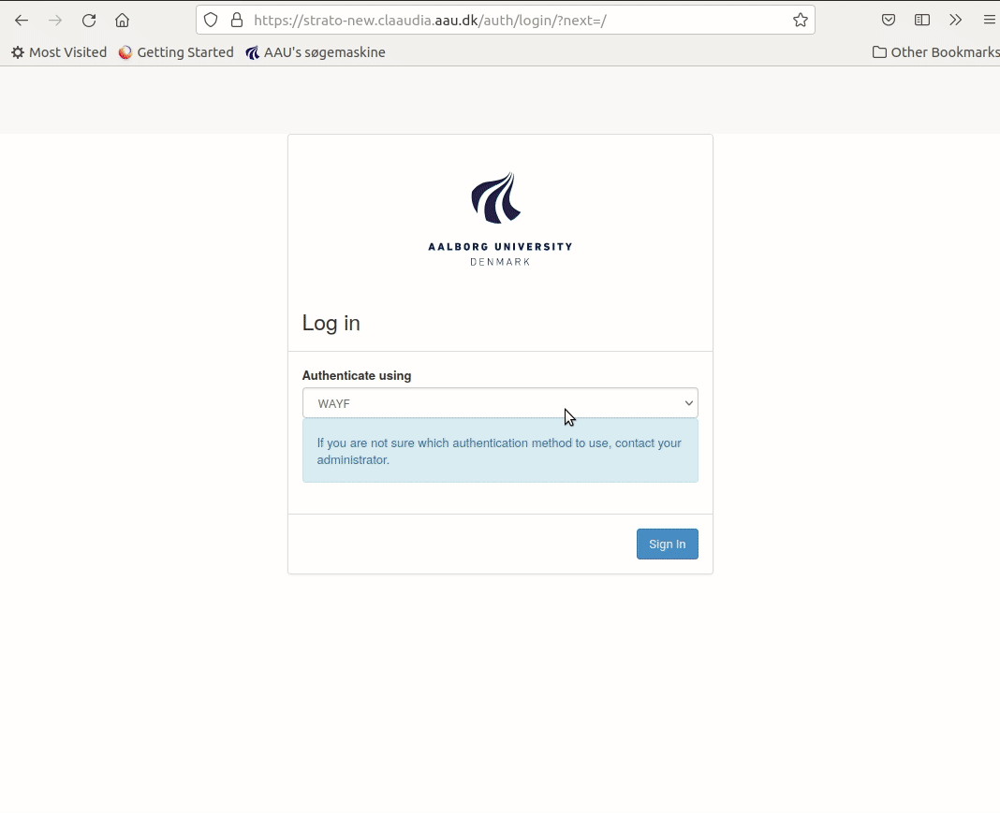
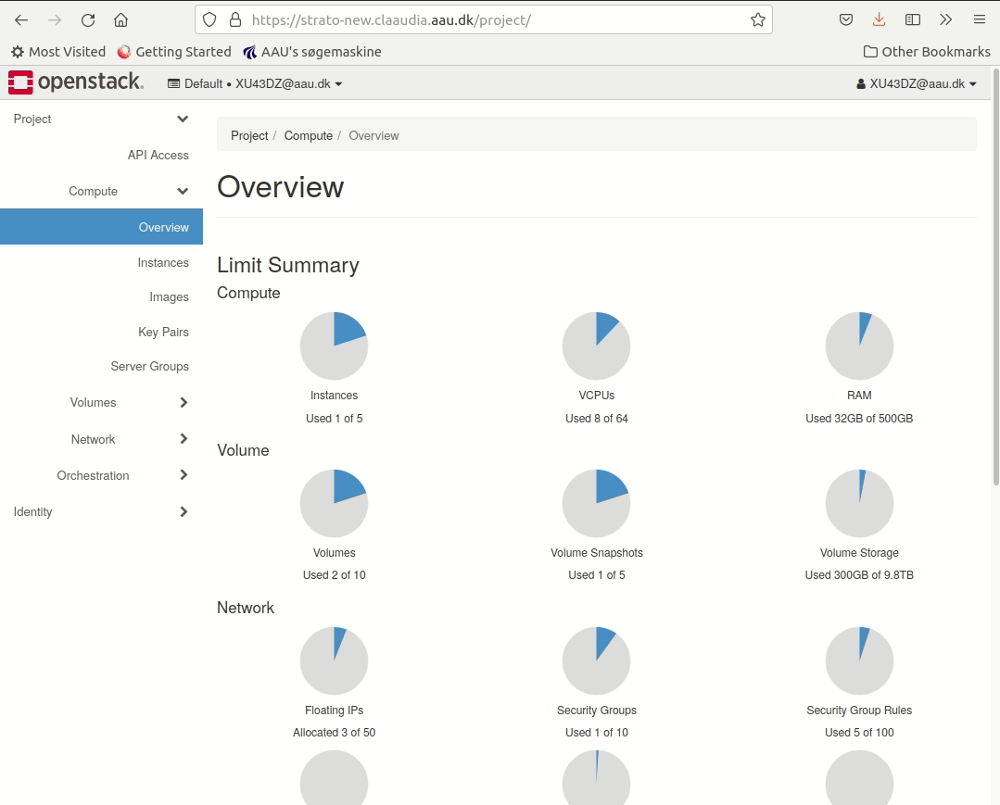
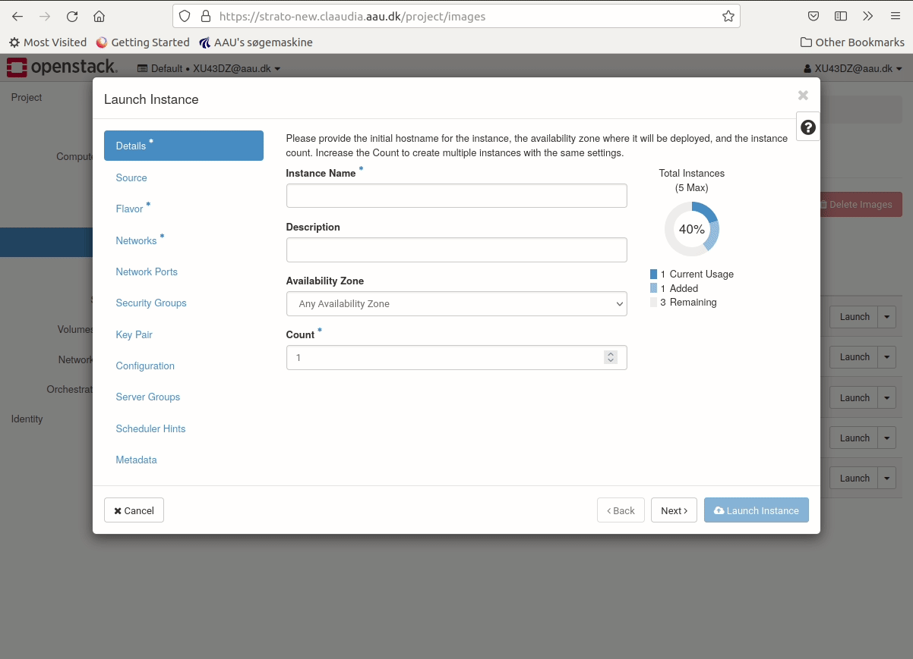
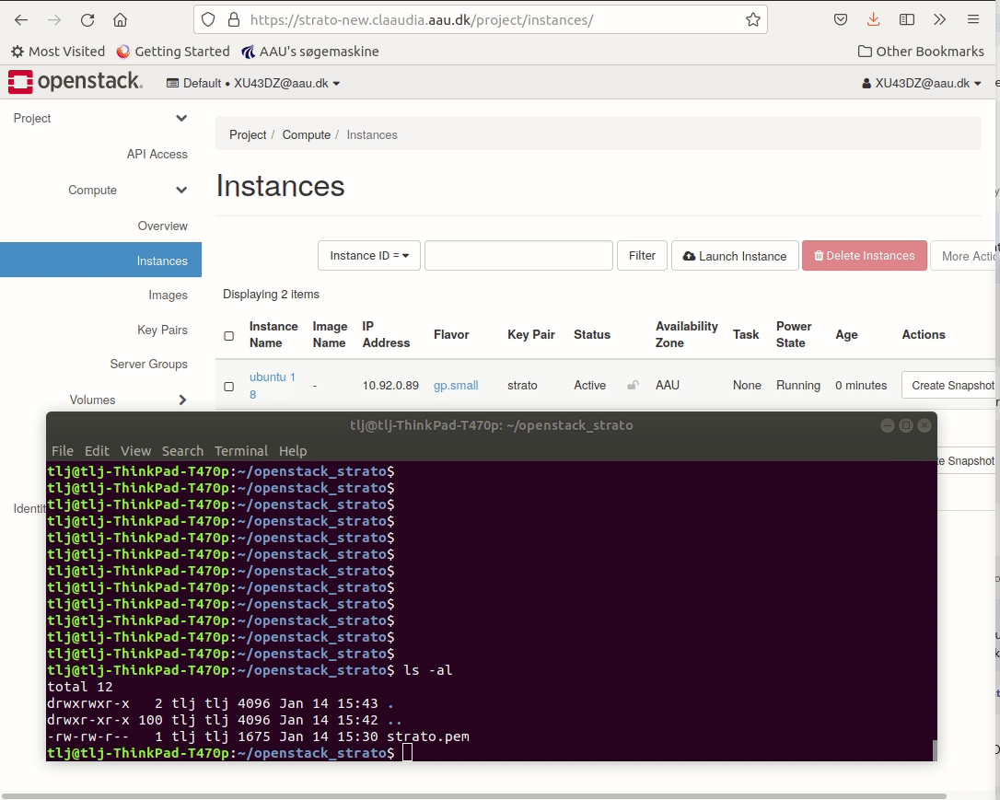
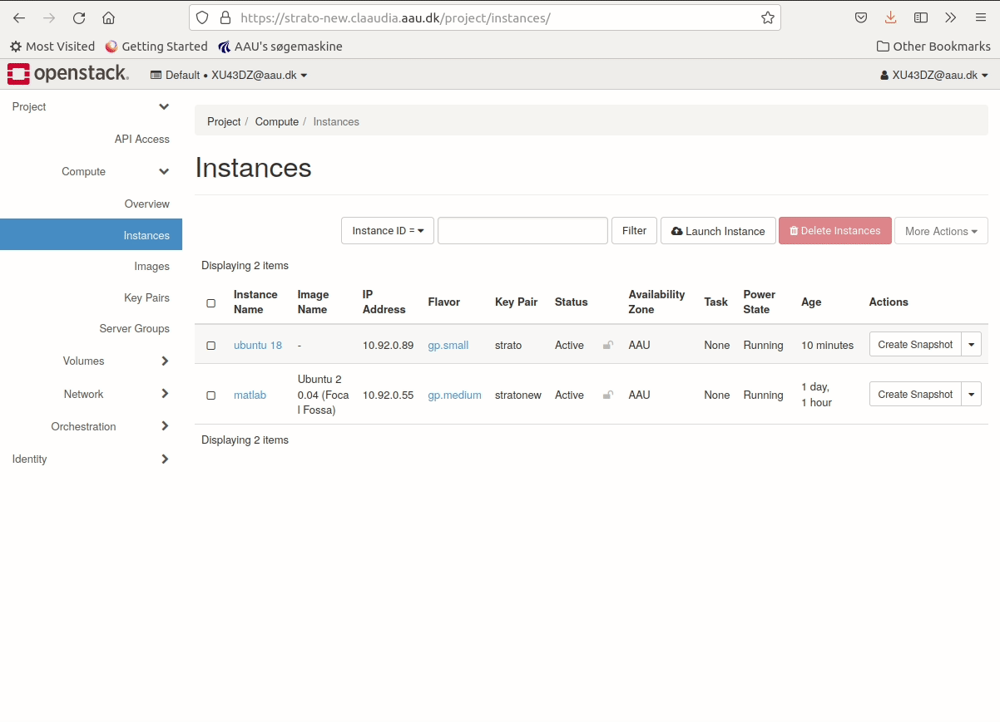

# CLAAUDIA Compute Cloud Strato - Quick start
Follow four steps to setup your first cloud instance and shelve, delete ot create an image when you're done. We will launch an instance with a gp.small flavour(2 vCPUs, 4GB RAM and 40GB storage) based on the Ubuntu 18.04 image (Ubuntu 18.04 LTS + AAU specific setup) and connect to it with SSH (you will need to be located at AAU or use e.g. [VPN](https://www.en.its.aau.dk/instructions/VPN)).

| **Image**                                             |**Compute Resources**|**Accessible**     |
|-------------------------------------------------------|---------------------|-------------------|
| [**Ubuntu 18.04 image**](guides/image-guides/ubuntu)| gp.small           | From the internet |

    
   1. [Login to the Cloud](#login-to-the-cloud) 
   2. [Setup Ubuntu cloud instance](#setup-an-ubuntu-cloud-instance)
   3. [Access the instance](#access-the-instance)
   4. [Shelve or delete an image](#shelve-or-delete-an-image)


## Login to the Cloud

To access the compute cloud go to **<https://strato-new.claaudia.aau.dk>** with your favorite browser. Ensure the *Authenticate Using* is set to **WAYF** and click **Connect**. You will be redirected to signon.aau.dk/... where you must login with your aau email and password, click **LOGIN** and now you should be send to the cloud dashboard.



## Setup an Ubuntu cloud instance

To create the ubuntu instance, common settings must be sat first. To access the ubuntu instance with SSH, port 22 must be open, furthermore an SSH Key-pair must be generated as login credentials.
 
### SSH rule

The compute cloud configures port access with **Security groups**. Each group can have a number of rules to permit access. Follow the steps to add port 22(for SSH) to the default security group.

1. Navigate to **Network**
2. Click the sub menu **Security Groups**
3. Click **Manage Rules** on the default Security group
4. Add a rule
5. Choose SSH from dropdown menu.


### Set SSH Key-pair

The compute cloud authenticates per default instances with a SSH keypair. Follow the steps to generate the key-pair we later will use to access the Ubuntu instance

1. Navigate to **Compute**
2. Click on the sub menu **Key Pairs**
3. Add new **Key Pair**
4. Fill out name and select SSH Key
5. Save the public key locally (you will need in later).


### Launch Ubuntu instance

To launch the Ubuntu instance navigate to the "launch instance" menu using the webinterface.

1. Navigate to the project tab.
2. Click the **Compute** sub-tab.
3. Click on **Images**.
4. Press **Launch** on the right side of the image you wish to Launch.



In the **launch instance** menu you can set settings for the instance. To launch your first ubuntu instance the following menu's settings must be applied.

- **Details** Choose an instance name. 
- **flavour** Apply the gp.small compute resource for a small first instance.
- **networks** Select Campus Network 01. If you are interested in having an instance that is globally accessible for e.g. hosting a webservice, copying data from another university etc., and hence also at a higher security risk, then select AAU Public.
- **security groups** Ensure that the default security group we edited earlier is applied (should be as default). 
- **key-pair** Ensure that the key-pair created earlier is applied (should be as default).




### Access the instance

The default way of accessing is via SSH. The default username is **ubuntu** for the Ubuntu 18.04 image we chose. Use the key-pair we generated earlier in the guide as following to access the instance.

On mac/linux open the terminal on windows open PowerShell or Command Prompt
```bash
ssh ubuntu@10.92.0.zzz -i yourPersonalKey.pem
```


{ loading=lazy }


Remember, you need to be on the AAU network using e.g. VPN. If you get a "Connection timed out" error then the error is likely due to not being on the network - connect using your VPN client and try again.

**Congratulations!** You've successfully created your first cloud instance! If you don't plan to use this ubuntu 18_04 instance, please [delete it ](https://git.its.aau.dk/CLAAUDIA/docs_openstack/src/branch/master/OpenStack_guides.md#delete-an-instance)

On some platforms/tools you might receive an error, saying that Permissions are too open. This can be adjusted with either setting the right permissions for the file or move the file to a specific folder.

#### Mac/Linux
```bash
chmod 600 yourPublicKey.pem
```
and then try to connect again.

#### Windows
Move the SSH key to the ".ssh" folder located in the home directory, for example 'C:\User\adf\.ssh' to set the right permissioins
and then try to connect again.

## Shelve or delete an image

If you dont need the instance right now, but maybe sometime soon again, you can shelve the instance. Then others can use the HW in the meantime such that we can get a good overall utilization of the platform. You can then unshelve when you need to work on the instance.

1. Navigate to the project tab
2. Click the **Compute** sub-tab
3. Click on **Instances**
4. Find the instance and the Action roll down.
5. Select "Shelve instance". After a bit of time, the Status should be "Shelved Offloaded"
6. When you need the instance again - select "Unshelve instance" under the Actions roll-down.

{ loading=lazy }

If you are done using your instance, then you can delete it.

1. Navigate to the project tab
2. Click the **Compute** sub-tab
3. Click on **Instances**
4. Mark the checkbox of the instance you wish to delete.
5. Press **Delete Instances** on the right side of the webpage.
6. press **Delete Instances** in the confirmation dialog.


