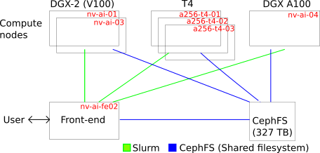

# AI Cloud II at AAU user information
This README contains information for getting started with the "AI Cloud II" system at AAU, links to additional resources, and examples of daily usage. We are many users on this system, so please consult the section on [Fair usage](#fair-usage) and follow the guidelines. We also have a [community site](https://web.yammer.com/main/groups/eyJfdHlwZSI6Ikdyb3VwIiwiaWQiOiI4NzM1OTg5NzYwIn0/all) at AAU Yammer where users can share experiences and we announce workshops, changes, and service to the system. If you have support questions, please contact us at support@its.aau.dk.

For new users, we recommend reading the [Introduction](#introduction) and [Getting started](#getting-started) section plus the section on [Fair usage](#fair-usage)

## New to AI Cloud II compared to old AI Cloud

The most important update:

*Heterogene system with two DGX II, 3 T4 nodes, and a DGX A100 (primarily CREATE users) and in the future additional GPU servers.*

This has some consequences across the system as we will describe in this documentation.

## Overview

Working on AI Cloud II is based on a combination of two different mechanisms, [Singularity](https://www.sylabs.io/docs/) and [Slurm](https://slurm.schedmd.com/documentation.html), which are used for the following purposes:

- **Singularity** is a container framework which serves to provide you with the necessary software environment to run your computational workloads. Different researchers may have widely different software stacks or perhaps versions of the same software stack that you need for your work. In order to provide maximum flexibility to you as users and to minimise potential compatibility problems between different software installed on the compute nodes, each user's software environment(s) is defined and provisioned as Singularity containers. You can both download pre-defined container images or configure or modify them yourself according to your needs.  
  See details on container images from NGC [further down](#a-few-words-on-container-images).

- **Slurm** is a queueing system that manages resource sharing in the AI Cloud. Slurm makes sure that all users get a fair share of the resources and get served in turn. Computational work in the AI Cloud can *only* be carried out through Slurm. This means you can only run your jobs on the compute nodes by submitting them to the Slurm queueing system. It is also through Slurm that you request the amount of ressources your job requires, such as amount of RAM, number of CPUs (logical CPUs with hyperthreading = 2 x physical CPUs = 2 x cores), number of GPUs etc.  
  See how to get started with Slurm [further down](#slurm-basics).

<!--**It is intended that all analysis on AI Cloud II are run via  containers which you start and manage by yourselves. It is possible to build singularity images from the NVIDIA's stock docker images [NVIDIA GPU Cloud](https://ngc.nvidia.com/) - check also this [Support Matrix](https://docs.nvidia.com/deeplearning/dgx/support-matrix/index.html "support matrix"). If you need something of your own taste, all software tools and their dependencies are supposed to be installed inside your containers. Furthermore, if you want to use the software stack again and again, it is a good idea to create a singularity image for that.**-->

The AI Cloud II will consist of the following compute nodes

| Name                        | Nodes in total |GPUs per node     | CPUs per node   | RAM per node | Disk          | NVLINK / NVSWITCH  | Primary usage             |
| ---                         | ---            | ---              | ---             | ---          | ---           | ---              | ---                       |
| a256-t4-[01-03].srv.aau.dk  | 3              | 6 (NVIDIA T4)    | 64 (AMD EPYC)   | 256 GB       | Non local     | Non              | Interactive / smaller single GPU jobs |
| nv-ai-[01,03].srv.aau.dk    | 2              | 16 (DGX-2, V100) | 96 (Intel Xeon) | 1470 GB      | 30TB /raid    | Yes              | Large / batch / multi-GPU jobs |
| nv-ai-04.srv.aau.dk         | 1              | 8 (DGX A100)     | 256 (AMD EPYC)  | 980 GB       | 14TB /raid    | Yes              | Large / batch / multi-GPU jobs |


 
CephFS is a shared filesystem that allow access to data in the home directory all both front-end and compute nodes. All users can allocate jobs on all nodes, but certain users from CREATE have priority on the DGX A100 node nv-ai-04.srv.aau.dk.

## Getting started

An alternative [workshop version](./workshop/SlurmAndSingularityTraining.pdf) intro to the system is also available. 

## Logging in
You can access the platform using [SSH](https://wiki.archlinux.org/index.php/OpenSSH#Client_usage).

Generally, the AI Cloud is only directly accessible when being on the AAU network, in this case you would access the front-end node by:
```console
ssh <aau-ID>@ai-fe02.srv.aau.dk
```
Replace `<aau-ID>` with your personal AAU ID. For some users, this is your email (e.g. `yourname@department.aau.dk`). For newer users, your AAU ID may be separate from your email address and have the form `AB12CD@department.aau.dk`; if you have this, use your AAU ID to log in.

If you wish to access while **not** being connected to the AAU network, you have two options: [Use VPN](https://www.en.its.aau.dk/instructions/VPN/) or use AAU's [SSH JumpHost](https://www.en.its.aau.dk/instructions/Username+and+password/SSH/).

If you're often outside AAU, you can use the SSH JumpHost through your personal ssh config (Linux/MacOS often located in: `$HOME/.ssh/config`).

```console
Host ai-fe02.srv.aau.dk
     User <aau-ID>
     ProxyJump %r@sshgw.aau.dk
```
Add the above configuration to your personal ssh config file (often located in: `$HOME/.ssh/config` on Linux or MacOS systems). Now you can easily connect to the platform regardless of network simply using `ssh claaudia-ai-cloud`.


## Slurm basics
To get a first impression, try:

```console
$ scontrol show node
....
NodeName=a256-t4-01.srv.aau.dk Arch=x86_64 CoresPerSocket=16 
   CPUAlloc=0 CPUTot=64 CPULoad=0.00
   AvailableFeatures=(null)
   ActiveFeatures=(null)
   Gres=gpu:6
   NodeAddr=a256-t4-01.srv.aau.dk NodeHostName=a256-t4-01.srv.aau.dk Version=21.08.0
   OS=Linux 5.4.0-91-generic #102-Ubuntu SMP Fri Nov 5 16:31:28 UTC 2021 
   RealMemory=244603 AllocMem=0 FreeMem=254971 Sockets=2 Boards=1
   State=IDLE ThreadsPerCore=2 TmpDisk=0 Weight=1 Owner=N/A MCS_label=N/A
   Partitions=batch,prioritized 
   BootTime=2022-01-04T10:56:32 SlurmdStartTime=2022-01-04T10:58:45
   LastBusyTime=2022-01-04T11:15:03
   CfgTRES=cpu=64,mem=244603M,billing=64,gres/gpu=6
   AllocTRES=
   CapWatts=n/a
   CurrentWatts=0 AveWatts=0
   ExtSensorsJoules=n/s ExtSensorsWatts=0 ExtSensorsTemp=n/s
....
```

The above command shows the names of the nodes, partitions (batch), etc. involved in the Slurm system.

## Slurm allocate resources

We can then allocate resources for us. Let us say we would like to allocate one GPU (NVIDIA T4)

```console
$ salloc --gres=gpu:1
salloc: Granted job allocation 606
salloc: Waiting for resource configuration
salloc: Nodes a256-t4-01.srv.aau.dk are ready for job
```

We can then check the queue

```console
$ squeue 
             JOBID PARTITION     NAME     USER ST       TIME  NODES NODELIST(REASON)
               606     batch interact tlj@its.  R       0:19      1 a256-t4-01.srv.aau.dk
```
Here the state (`ST`) is "running" (` R`). If there were not enough resources, the state would be "pending" (PD).

You can then run jobs with this allocation using srun - like `srun <bash command>`
```console
$ srun df -h
Filesystem                                                            Size  Used Avail Use% Mounted on
....
172.21.232.61:6789,172.21.232.14:6789,172.21.232.15:6789:/ai/aicloud  328T  943G  327T   1% /home
```

The important line here for now, is the shared data located in '/home' where users have their home data, e.g,

```bash
lj@its.aau.dk@ai-fe02:~$ echo $HOME
/home/its.aau.dk/tlj
```

If you have a job on a node, you can also ssh to that node
```console
$ ssh a256-t4-01
```

and say run
```console
tlj@its.aau.dk@a256-t4-01:~$ nvidia-smi 
Wed Jan  5 09:51:43 2022       
+-----------------------------------------------------------------------------+
| NVIDIA-SMI 470.86       Driver Version: 470.86       CUDA Version: 11.4     |
|-------------------------------+----------------------+----------------------+
| GPU  Name        Persistence-M| Bus-Id        Disp.A | Volatile Uncorr. ECC |
| Fan  Temp  Perf  Pwr:Usage/Cap|         Memory-Usage | GPU-Util  Compute M. |
|                               |                      |               MIG M. |
|===============================+======================+======================|
|   0  Tesla T4            Off  | 00000000:01:00.0 Off |                    0 |
| N/A   62C    P0    28W /  70W |      0MiB / 15109MiB |      0%      Default |
|                               |                      |                  N/A |
+-------------------------------+----------------------+----------------------+
                                                                               
+-----------------------------------------------------------------------------+
| Processes:                                                                  |
|  GPU   GI   CI        PID   Type   Process name                  GPU Memory |
|        ID   ID                                                   Usage      |
|=============================================================================|
|  No running processes found                                                 |
+-----------------------------------------------------------------------------+
```

You can view information on your job using
```console
scontrol show job <JOBID>
```

or additional details like the GPU IDX using
```console
scontrol -d show job <JOBID>
```

The allocation can be relinquished with
```console
exit
```

or with a Slurm cancel statement
```console
scancel <JOBID>
```

## Slurm QoS

*!!!!!! Needs update !!!!!!!!*

By default, jobs are run with the 'normal' Quality-of-Service (QoS). If you need several/additional GPUs (multi GPU) or longer run time, use this query command to find out and choose the suitable QoS for your need.

```console
$ sacctmgr show qos format=name,maxtresperuser%20,maxwalldurationperjob
      Name            MaxTRESPU     MaxWall
---------- -------------------- -----------
    normal    cpu=20,gres/gpu=1  2-00:00:00
     short    cpu=32,gres/gpu=4    00:20:00
   allgpus    cpu=48,gres/gpu=8 21-00:00:00
  1gpulong    cpu=16,gres/gpu=1 14-00:00:00
 admintest   cpu=96,gres/gpu=16  1-00:00:00
      1cpu                cpu=1    06:00:00
  deadline    cpu=64,gres/gpu=8 14-00:00:00 
```

To make an example, it is possible to allocate two GPUs by

```console
salloc --qos=allgpus --gres=gpu:2
```
where 'allgpus' above can be one of the following:

- normal: for one-GPU job (the default QoS).
- short: for 1 or more small GPU jobs - possible for testing batch submission or interactive jobs.
- allgpus: for 1 or more large GPU jobs.
- 1gpulong: for 1 large one-GPU job.
- admintest: special QoS only usable by administrators for full node testing.
- 1cpu: assigned to inactive student users after each semester (no GPU).
- deadline: a QoS where users with a hard publication deadline can apply for access to. To get access, please follow [this guide](#do-you-have-an-upcoming-deadline).

Besides this, jobs in smaller QoS groups in general have a [higher priority](#priority), such that they will tend to be allocated before jobs with a lower priority. Jobs submitted in the 'deadline' QoS have the highest priority.

## Getting your (Singularity) environment up
It is possible to run everything from a single line. First pull a docker image and convert it to a singularity image

```console
srun singularity pull docker://nvcr.io/nvidia/cuda:latest
```

This may take some time. There is now an image called 'cuda_latest.sif' that we can make use of. The address 'docker://nvcr.io/nvidia/cuda:latest' identifies where to retrieve the image on NVIDIA GPU Cloud (NGC) - more about this further down.  
Notice that we used both Slurm (`srun`) and Singularity (`singularity`) above to retrieve an image. `srun` is for executing the actual job in AI Cloud. `singularity` must be executed on one of the compute nodes, which `srun` takes care of. You cannot execute `singularity` directly on the front-end node. `singularity` here retrieves the specified (Docker) image from NGC and automatically converts it to a Singularity image.

To execute a command at the compute node with certain specified resources, we can do

```console
$ srun --gres=gpu:1 singularity exec --nv docker://nvcr.io/nvidia/cuda:latest nvidia-smi
INFO:    Using cached SIF image
Wed Jan  5 10:21:27 2022       
+-----------------------------------------------------------------------------+
| NVIDIA-SMI 470.86       Driver Version: 470.86       CUDA Version: 11.4     |
|-------------------------------+----------------------+----------------------+
| GPU  Name        Persistence-M| Bus-Id        Disp.A | Volatile Uncorr. ECC |
| Fan  Temp  Perf  Pwr:Usage/Cap|         Memory-Usage | GPU-Util  Compute M. |
|                               |                      |               MIG M. |
|===============================+======================+======================|
|   0  Tesla T4            Off  | 00000000:01:00.0 Off |                    0 |
| N/A   43C    P0    26W /  70W |      0MiB / 15109MiB |      0%      Default |
|                               |                      |                  N/A |
+-------------------------------+----------------------+----------------------+
                                                                               
+-----------------------------------------------------------------------------+
| Processes:                                                                  |
|  GPU   GI   CI        PID   Type   Process name                  GPU Memory |
|        ID   ID                                                   Usage      |
|=============================================================================|
|  No running processes found                                                 |
+-----------------------------------------------------------------------------+
```

Here `--gres=gpu:1` states that we are want to allocate one GPU. The `--nv` argument states that we are using the nvidia runtime environment.

## A few words on container images

*Is this still correct????*

In the previous section, we saw how to retrieve an image from NGC and how to instantiate that image as a Singularity container and execute a command in it. The image was retrieved from NVIDIA GPU Cloud (NGC). NGC is NVIDIA's official repository with many different images of useful software environments for deep learning and other GPU-accelerated tasks. The images in NGC have been specially built for NVIDIA GPUs and can be very convienient to use out-of-the-box instead of having to configure your software environment from scratch yourself.

NGC's container images are Docker images, but Singularity can convert them on the fly to run as Singularity containers. Docker itself is not used in AI Cloud due to security concerns in multi-user environments. You can also use images from other Docker repositories such as [Docker Hub](https://hub.docker.com/). Remember to look for images that are built with support for NVIDIA GPUs.

You can read more here about how to [Build images from
scratch](https://sylabs.io/guides/3.5/user-guide/quick_start.html#build-images-from-scratch)
or modify images from NGC.

Once images are built, they are immutable meaning that you cannot
install additional software inside the images themselves at container
runtime. Sometimes, especially when running Python software, it can be
convenient to install additional packages into your runtime
environment using `pip`. This can cause special challenges which you
can read more about and see how to solve in [Installing Python
packages with pip in Singularity
containers](./examples/pip_in_containers.md). See
also
[Troubleshooting](TroubleShooting.md#user-content-cannot-dlopen-some-tensorrt-libraries).

## Where to save your files

The front-end node and compute nodes have access to a distributed file system in '/home' based on Ceph FS. To see this, first create a file on the front-end node in your home directory

```console
echo "I have just created this" > example.txt
```

This is available on the front-end node. But you can also "see" this on a compute node

```console
$ srun cat example.txt
I have just created this
```

## Using the scratch space

The DGX-2 and A100 compute node has a scratch space for storing temporary data. It is a RAID0 NVME (SSD) partition with high disk I/O capacity. It can be used if need to move a significant amount of data fast. Following are two ways you can use it for your jobs:

### Via interactive bash session:

Since the RAID scratch space is local to each compute node, you need to specify the exact node you want to use with the `--nodelist` argument as below:

```console
srun --pty --nodelist=nv-ai-01.srv.aau.dk bash -l
srun: job 575 has been allocated resources

tlj@its.aau.dk@nv-ai-01:~$ ls /raid/
tlj@its.aau.dk@nv-ai-01:~$ mkdir -p /raid/its.tlj # create a folder to hold your data. It's a good idea to use this path pattern: /raid/<subdomain>.<username>.
tlj@its.aau.dk@nv-ai-01:~$ cp -a /user/its.aau.dk/tlj/testdata /raid/its.tlj/
tlj@its.aau.dk@nv-ai-01:~$ exit # quit interactive session.
```

After the data has been copied to the `/raid` folder, you can use it by referring to the data in your code. For example:

```console
srun --pty --nodelist=nv-ai-01.srv.aau.dk ls /raid/its.tlj/testdata
```

### Via sbatch job script

You can script the whole chain of commands into an `sbatch` script

```console
#!/usr/bin/env bash
#SBATCH --job-name MySlurmJob # CHANGE this to a name of your choice
#SBATCH --partition batch # equivalent to PBS batch
#SBATCH --time 24:00:00 # Run for up to 24 hours
#SBATCH --qos=normal 
#SBATCH --gres=gpu:1 # CHANGE this if you need more or less GPUs

## Preparation
mkdir -p /raid/its.tlj # create a folder to hold your data. It's a good idea to use this path pattern: /raid/<subdomain>.<username>.

if [ !-d /raid/its.tlj/testdata ]; then
     cp -a /user/its.aau.dk/tlj/testdata /raid/its.tlj/
fi

## Run actual analysis
## The benefit with using multiple srun commands is that this creates sub-jobs for your sbatch script and can be used for advanced usage with SLURM (e.g. create checkpoints, recovery, ect)
srun singularity exec -B /raid/its.tlj/:/data myimage.sif python /path/to/my/first/python/script --arg1 /data
srun singularity exec -B /raid/its.tlj/:/data myimage.sif python /path/to/my/second/python/script --arg1 /data
```

Notice the `-B' [bind](https://sylabs.io/guides/3.8/user-guide/bind_paths_and_mounts.html) that connects data on the host to a specific path in the container. Here '/raid/its.tlj/' on the node is bind to '/data' in the container.

A script such as the above can be submitted to the Slurm queue using the `sbatch` command
```console
sbatch <name-of-script>
```

## Transferring files
You can transfer files to/from AI Cloud using the command line utility `scp` from your local computer (Linux and OS X). *To* AI Cloud:
```console
$ scp some-file <USER ID>@ai-fe02.srv.aau.dk:~
```
where '~' is your user folder on AI Cloud. `<USER ID>` could for example be ‘ab34ef@department.aau.dk’.  
You can append folders below that to your destination:
```console
$ scp some-file <USER ID>@ai-fe02.srv.aau.dk:~/some-folder/some-subfolder/
```

You can also copy from the old AI Cloud with
```console
$ scp <USER ID>@ai-pilot.srv.aau.dk:~/some-folder/some-subfolder/ .
```

In general, file transfer tools that can use SSH as protocol should work. A common choice is [FileZilla](https://filezilla-project.org/) or the Windows option [WinSCP](https://winscp.net/).

If you wish to mount a folder in AI Cloud on your local computer for easier access, you can also do this using `sshfs` (Linux command line example executed on your local computer):

```console
mkdir aicloud-home
sshfs <USER ID>@ai-pilot.srv.aau.dk:/user/<DOMAIN>/<ID> aicloud-home
```
where `<DOMAIN>` is 'department.aau.dk' and `<ID>` is 'ab34ef' for user 'ab34ef@department.aau.dk'.

## Ways of using Slurm

Just to summarise from the above examples, there are three typical was of executing work through Slurm:
- Allocate resources: use `salloc` (see [Slurm allocate resources](#slurm-allocate-resources). This reserves the requested resources for you which you can then use when they are ready. This means you can for example log into the specified compute node(s) to use it/them interactively (you cannot do this without having allocated resources on them).
- Run command directly through Slurm: use `srun` (see [Getting your (Singularity) environment up](#getting-your-singularity-environment-up)). This runs the specified command directly on the requested resources as soon as they are ready. The `srun` command will block until done.
- Schedule one or more jobs to run whenever ressources become ready: use `sbatch` (example in [Via sbatch job script](#via-sbatch-job-script)). This command lets you specify the details of your job in a script which you submit to the queue via `sbatch`. This is convenient if for example you have a large job consisting of many steps or many jobs that you want to specify at once and just leave it to Slurm to get the work done when resources are ready.  
  This is the most convenient way to run jobs once you know in advance what you need done. It allows you to specify even very large and complicated amounts of work here and now and then just leave it to Slurm to get things run as soon as resources are available. This way, you will not have to sit around and wait for it. The `sbatch` command returns immediately and you can then use `squeue` to inspect where your jobs are in the queue.

## Inspecting your utilization
It is recommended practice, after you have configured your environment/pipeline, that you inspect your GPU utilization [%], and possibly memory utilization, to see if you

1. indeed are utilizing the GPU as expected.
2. achieve a somewhat acceptable level of GPU utilization.

You can do this with the `nvidia-smi` command, by executing e.g. the following in your environment. First, get an interactive resource:

```console
srun --gres=gpu:1 --pty singularity shell --nv myimage.sif
```

Start observing with nvidia-smi:

```console
nvidia-smi --query-gpu=index,timestamp,utilization.gpu,utilization.memory,memory.total,memory.used,memory.free --format=csv -l 5 > util.csv &
```

then start your (small) code in the background using e.g.

```console
python .....
```

Afterwards have a look at the reported utilization

```console
Singularity> cat util.csv
index, timestamp, utilization.gpu [%], utilization.memory [%], memory.total [MiB], memory.used [MiB], memory.free [MiB]
0, 2020/11/12 13:48:11.412, 99 %, 52 %, 32480 MiB, 30994 MiB, 1486 MiB
0, 2020/11/12 13:48:16.415, 99 %, 90 %, 32480 MiB, 30994 MiB, 1486 MiB
0, 2020/11/12 13:48:21.417, 99 %, 51 %, 32480 MiB, 30994 MiB, 1486 MiB
0, 2020/11/12 13:48:26.419, 98 %, 61 %, 32480 MiB, 30994 MiB, 1486 MiB
0, 2020/11/12 13:48:31.424, 100 %, 88 %, 32480 MiB, 30994 MiB, 1486 MiB
0, 2020/11/12 13:48:36.427, 32 %, 33 %, 32480 MiB, 30994 MiB, 1486 MiB
0, 2020/11/12 13:48:41.428, 98 %, 70 %, 32480 MiB, 30994 MiB, 1486 MiB
0, 2020/11/12 13:48:46.435, 100 %, 91 %, 32480 MiB, 30994 MiB, 1486 MiB
0, 2020/11/12 13:48:51.437, 99 %, 48 %, 32480 MiB, 30994 MiB, 1486 MiB
0, 2020/11/12 13:48:56.440, 100 %, 91 %, 32480 MiB, 30994 MiB, 1486 MiB
0, 2020/11/12 13:49:01.441, 99 %, 38 %, 32480 MiB, 30994 MiB, 1486 MiB
0, 2020/11/12 13:49:06.443, 97 %, 63 %, 32480 MiB, 30994 MiB, 1486 MiB
0, 2020/11/12 13:49:11.444, 35 %, 36 %, 32480 MiB, 30994 MiB, 1486 MiB
0, 2020/11/12 13:49:16.446, 98 %, 72 %, 32480 MiB, 30994 MiB, 1486 MiB
0, 2020/11/12 13:49:21.447, 100 %, 88 %, 32480 MiB, 30994 MiB, 1486 MiB
0, 2020/11/12 13:49:26.449, 98 %, 68 %, 32480 MiB, 30994 MiB, 1486 MiB
0, 2020/11/12 13:49:31.451, 98 %, 68 %, 32480 MiB, 30994 MiB, 1486 MiB
```

Now we are certain that the code and software is set up to utilize the GPU.

You can also do this by the script `getUtilByJobId` after job submission.

```console
nv-ai-fe01:~$ getUtilByJobId.sh 83549
To end, do a CRTL-C

utilization.gpu
Percent of time over the past sample period during which one or more kernels was executing on the GPU.
The sample period may be between 1 second and 1/6 second depending on the product.

utilization.memory
Percent of time over the past sample period during which global device memory was being read or written.
The sample period may be between 1 second and 1/6 second depending on the product.

memory.total
Total installed GPU memory.

memory.used
Total memory allocated by active contexts.

memory.free
Total free memory.
salloc: Granted job allocation 84172
salloc: Waiting for resource configuration
salloc: Nodes nv-ai-03.srv.aau.dk are ready for job
tlj@its.aau.dk@nv-ai-03.srv.aau.dk's password: 
index, timestamp, utilization.gpu [%], utilization.memory [%], memory.total [MiB], memory.used [MiB], memory.free [MiB]
0, 2020/11/12 14:02:14.854, 98 %, 66 %, 32480 MiB, 30994 MiB, 1486 MiB
0, 2020/11/12 14:02:19.858, 0 %, 0 %, 32480 MiB, 30994 MiB, 1486 MiB
0, 2020/11/12 14:02:24.861, 48 %, 42 %, 32480 MiB, 30994 MiB, 1486 MiB
0, 2020/11/12 14:02:29.863, 99 %, 72 %, 32480 MiB, 30994 MiB, 1486 MiB
0, 2020/11/12 14:02:34.864, 72 %, 57 %, 32480 MiB, 30994 MiB, 1486 MiB
0, 2020/11/12 14:02:39.868, 100 %, 68 %, 32480 MiB, 30994 MiB, 1486 MiB
0, 2020/11/12 14:02:44.871, 99 %, 66 %, 32480 MiB, 30994 MiB, 1486 MiB
0, 2020/11/12 14:02:49.872, 99 %, 66 %, 32480 MiB, 30994 MiB, 1486 MiB
0, 2020/11/12 14:02:54.875, 99 %, 68 %, 32480 MiB, 30994 MiB, 1486 MiB
0, 2020/11/12 14:02:59.884, 11 %, 7 %, 32480 MiB, 30994 MiB, 1486 MiB
^Csalloc: Relinquishing job allocation 84172
```

where 83549 is the Slurm JobId. If your job does not behave as intended, then please analyse the problem and try to solve the issue. It is not good practice to have allocated but not utilizing GPUs on the system.

## Fair usage
The following guidelines are put in place to have a fair usage of the system for all users. The following text might be updated from time to time such that we can better serve all users.

ITS/CLAAUDIA work from the following principles for fair usage:

- Good research is the success criterion and ITS/CLAAUDIA should lower the barrier for allowing this.
- Researchers should enter on a level playing field.
- ITS has an administrative and technical role and should in general not determine what research should have a higher priority. Students are vetted with recommendation of supervisor/staff backing that this is for research purposes.
- Aim at the most open and unrestricted access model.

Based on these principles we kindly ask that all users consider the following guidelines:

- Please be mindful of your allocations and refrain from allocating many resources without knowing/testing/verifying that you indeed can make good usage of the allocated resources.
- Please be mindful and de-allocate the resources if you do no use them. Then other users can make good use of these.

If in doubt, you can do
```console
squeue -u $USER
```
and inspect you own allocations. If you have allocations you are not using, then please cancel these resource allocations.

A few key points to remember:

1. Please refrain from doing pre-emptive allocations. From the current load, we still conclude that there are enough resources if the resources are used wisely.
2. There are resources available in the evenings/nights and weekends. If possible, start your job as a batch script (`sbatch`), and let it queue and rest while the computer does the work. Maybe even better, put the job to queue late in the afternoon or use `-b`, `--begin` option with your batch script, e.g. add the line

```console
#SBATCH --begin=18:00:00
```

ITS/CLAAUDIA will keep analysing and observing the usage of the system to make the best use of the available resources based on the above principles and guidelines. If ITS/CLAAUDIA is in doubt, we will contact users and ask if the resource allocations are in line with the above principles and guidelines. We have previously contacted users in this regard, and will be more active in periods of high utilization.

## Do you have an upcoming deadline?
If you are working towards an upcoming deadline, and find it difficult to have the resources you need, then please send an email to support@its.aau.dk with a URL (call for papers etc.) stating the deadline. We can provide some hints, help and possibly additional resources to help you meet your deadline.


## Data deletion
From time to time we observe if users no longer are listed in the central database. Users can be removed when the studies or employment ends. We will as a last option try to reach you by email. If this fails, we reserve the right to delete data in your home directory and on the compute node, e.g. /raid.

