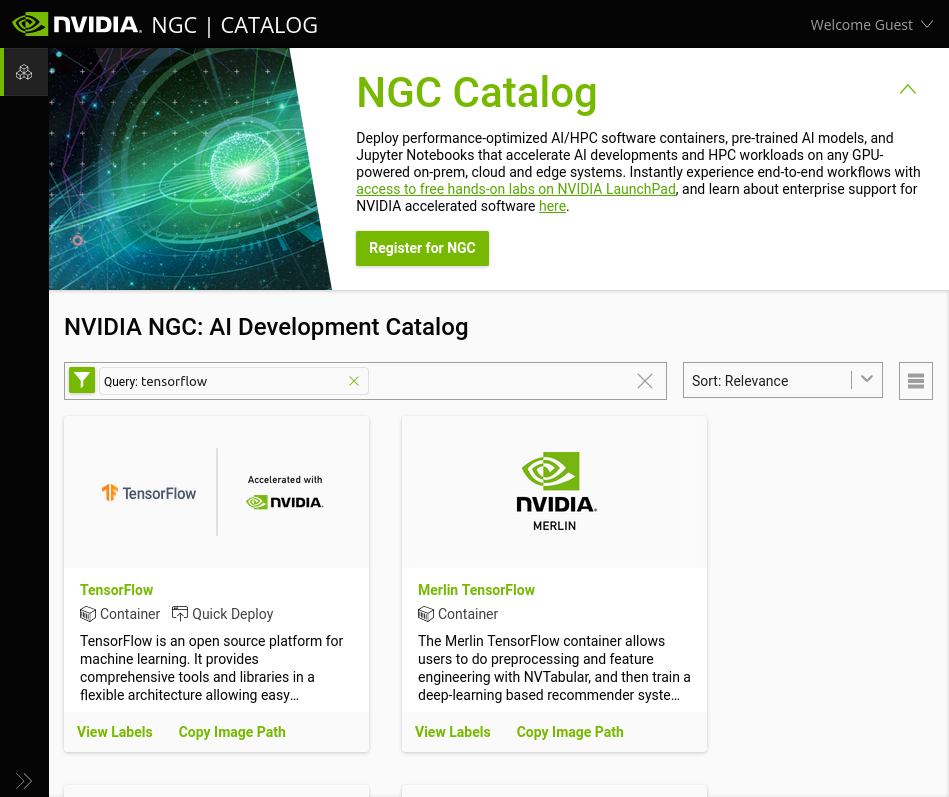
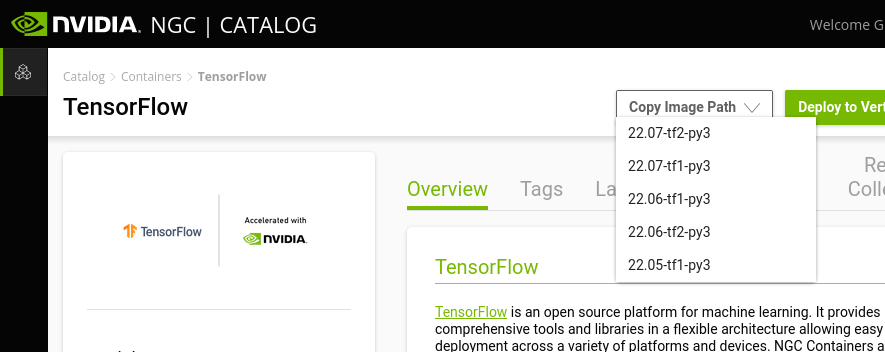

This section describes how to get started with the AI Cloud at AAU.  
We are many users on this system, so please consult the section on
[Fair usage](#fair-usage) and follow the guidelines. We also have a
[community
site](https://web.yammer.com/main/groups/eyJfdHlwZSI6Ikdyb3VwIiwiaWQiOiI4NzM1OTg5NzYwIn0/all)
at AAU Yammer where users can share experiences and administrators
announce workshops, changes, and service to the system. If you have
support questions, please contact us at
[support@its.aau.dk](mailto:support@its.aau.dk).

For new users, we recommend reading the [front page](index.md) and
[Overview](overview.md) section plus the section on [Fair
usage](#fair-usage)

## Overview

<!--**It is intended that all analysis on AI Cloud II are run via  containers which you start and manage by yourselves. It is possible to build singularity images from the NVIDIA's stock docker images [NVIDIA GPU Cloud](https://ngc.nvidia.com/) - check also this [Support Matrix](https://docs.nvidia.com/deeplearning/dgx/support-matrix/index.html "support matrix"). If you need something of your own taste, all software tools and their dependencies are supposed to be installed inside your containers. Furthermore, if you want to use the software stack again and again, it is a good idea to create a singularity image for that.**-->

The AI Cloud consists of the following compute nodes:

| Name                        | Nodes in total |GPUs per node   | CPU cores per node | CPU HW threads | RAM per node | RAM per GPU  | Disk         | NVLINK / NVSWITCH | Primary usage                         |
| ---                         | ---            | ---            | ---                | ---            | ---          | ---          | ---          | ---               | ---                                   |
| a256-t4-[01-03].srv.aau.dk  | 3              | 6 (NVIDIA T4)  | 32 (AMD EPYC)      | 64             | 256 GB       | 16 GB        | None locally | No                | Interactive / smaller single-GPU jobs |
| i256-a10-[06-10].srv.aau.dk | 5              | 4 (NVIDIA A10) | 32 (Intel Xeon)    | 64             | 256 GB       | 24 GB        | None locally | No                | Interactive / medium single-GPU jobs |
| a256-a40-[04-07].srv.aau.dk | 4              | 3 (NVIDIA A40) | 32 (AMD EPYC)    | 32             | 256 GB       | 48 GB        | None locally | No                | Large single-GPU jobs |
| i256-a40-[01-02].srv.aau.dk | 2              | 4 (NVIDIA A40) | 24 (Intel Xeon)    | 24             | 256 GB       | 48 GB        | 6.4 TB /raid | Yes (2&times;2)  | Large single-/multi-GPU jobs |
| nv-ai-[01/03].srv.aau.dk    | 2              | 16 (NVIDIA V100) | 48 (Intel Xeon)    | 96             | 1470 GB      | 32 GB        | 30 TB /raid   | Yes               | Large / batch / multi-GPU jobs        |
| nv-ai-04.srv.aau.dk         | 1              | 8 (NVIDIA A100) | 128 (AMD EPYC)     | 256            | 980 GB       | 40 GB        | 14 TB /raid   | Yes               | Large / batch / multi-GPU jobs        |

!!! important

    The compute nodes nv-ai-04, i256-a40-01, and i256-a40-02 are owned
    by specific research groups or centers which have first-priority
    access to them. Other users can only access them on a limitied basis
    where your jobs may be cancelled by higher-priority jobs. Users
    outside the prioritised group can only use them via the "batch"
    partition (use option `--partition=batch` for your jobs). See
    [Slurm jobs](#slurm-jobs).

## Getting started

An alternative [workshop
version](./workshop/SlurmAndSingularityTraining.pdf) introduction is
also available, but this only applies to the AI Cloud pilot platform.

### Logging in

You can access the platform using
[SSH](https://wiki.archlinux.org/index.php/OpenSSH#Client_usage). How
to use SSH depends on which operating system you use on your local
computer:

Linux
: If you use a modern Linux distribution such as Ubuntu on your
  computer, the necessary tools to connect to AI Cloud are usually
  already installed by default.

OS X (Apple)
: OS X has SSH built into the command line terminal. This means you
  can invoke SSH commands as shown in the following examples directly
  from your command line.  
  OS X does, however, not have a built-in [X
  server](https://en.wikipedia.org/wiki/X.Org_Server) so it is
  necessary to install additional software if you wish to be able to
  show the graphical user interface (GUI) of applications (using X
  forwarding).  
  Installing [XQuartz](https://www.xquartz.org/) should enable OS X to
  use X forwarding.

Windows (Microsoft)
: Newer versions of Windows have SSH built into the command line
  terminal. This means you can invoke SSH commands as shown in the
  following examples directly from your command line.  
  Windows does, however, not have a built-in [X
  server](https://en.wikipedia.org/wiki/X.Org_Server) either so it is
  necessary to install additional software if you wish to be able to
  show the graphical user interface (GUI) of applications (using X
  forwarding).  
  If you wish to use a convenient way to connect to the AI Cloud from
  Windows with the ability to display the GUI of applications you run
  in AI Cloud, we recommend that you install and use
  [MobaXterm](https://mobaxterm.mobatek.net/) on your local computer.

The AI Cloud is only directly accessible when being on the AAU network
(including VPN). You can connect to AI Cloud front-end node by running
the following command on the command line of your local computer:

???+ example

    ```console
    ssh -l <aau email> ai-fe02.srv.aau.dk
    ```

    Replace `<aau email>` with your AAU email address, e.g.


   ```console
   ssh -l tari@its.aau.dk ai-fe02.srv.aau.dk
   ```

If you wish to access while **not** being connected to the AAU
network, you have two options: [Use
VPN](https://www.en.its.aau.dk/instructions/VPN/) or use AAU's [SSH
gateway](https://www.en.its.aau.dk/instructions/ssh).

??? info

    If you are often outside AAU, you can use the SSH gateway by default
    through your personal SSH configuration (in Linux/OS X this is often
    located in: `$HOME/.ssh/config`).

    ```console
    Host ai-fe02.srv.aau.dk
         User <aau email>
         ProxyJump %r@sshgw.aau.dk
    ```

    Add the above configuration to your personal ssh config file (often
    located in: `$HOME/.ssh/config` on Linux or OS X systems). Now you
    can easily connect to the platform regardless of network using the
    commands from preceding examples.

### Transferring files

You can transfer files to/from AI Cloud using the command line utility
`scp` from your local computer (Linux and OS X). *To* AI Cloud:

???+ example

    ```console
	scp some-file <aau email>@ai-fe02.srv.aau.dk:~
	```

    where '~' means your user directory on AI Cloud. You can append
    directories below that to your destination:

???+ example

    ```console
	scp some-file <aau email>@ai-fe02.srv.aau.dk:~/some-dir/some-sub-dir/
	```

You can also copy in the opposite direction, e.g. from the AI Cloud
pilot platform to your local computer with:

???+ example

    ```console
	scp <aau email>@ai-fe02.srv.aau.dk:~/some-folder/some-subfolder/some-file .
	```

    where '.' means the current directory you are located in on your local
	computer.

In general, file transfer tools that can use SSH as protocol should
work. A common choice is [FileZilla](https://filezilla-project.org/)
or the Windows application [WinSCP](https://winscp.net/).

## Running jobs

As mentioned on the [Overview](overview.md) page, two important
building blocks of the AI Cloud are the queue system Slurm and the
container technology Singularity. In order to run a computation,
analysis, simulation, training of a machine learning algorithm etc.,
it is necessary to first obtain a container to run your application in
(in most cases) and to queue it as a job in the queue system
(mandatory). The queue system is the only way to get access to running
applications on the compute nodes.

!!! warning

    The front-end nodes of the AI Cloud pilot platform and the AI Cloud
    are not meant for running computationally intensive applications. If
    you attempt to do so anyway, this risks rendering the entire AI Cloud
    inaccessible to you and all other users on it, because you exhaust the
    memory and/or CPU capacity of the front-end node. This is not
    considered acceptable use of the platform and is not allowed.

### Slurm jobs

The first important building block to be aware of is the queue system
Slurm.

Applications can only be run on the compute nodes through Slurm. You
quite literally only have access to the compute nodes when you have a
job allocated on them.

The simplest way to run a job via Slurm is to use the command `srun`.

!!! example

	```console
    srun hostname
	```
	This runs the command `hostname` as a job in the queue system. When
    run like this with no further parameters specified, Slurm will run the
    command on the first compute node available.  
	On the AI Cloud pilot platform, this will either be nv-ai-01.srv.aau.dk
	or nv-ai-03.srv.aau.dk. On the AI Cloud, it will be
	a256-t4-01.srv.aau.dk, a256-t4-02.srv.aau.dk, or a256-t4-03.srv.aau.dk.  
	The command will return one of these host names. If the command displays
	"srun: job XXXXXX queued and waiting for resources", this means that all
	compute nodes are fully occupied (by other users' jobs) and your job is
	waiting in queue to be executed when resources become available.

This was your first Slurm job. You will need this (`srun`) and other
Slurm commands for most of your work in AI Cloud. You will see more
examples in combination with Singularity in the next section. Further
details about Slurm can be found on the [Running jobs](slurm.md)
page. The Danish e-infrastructure Cooperation (Deic) also hosts a great
[e-learning course](http://slurmlearning.deic.dk/) that might be helpful.

### Singularity containers

Only a small set of typical Linux command line tools are installed on
the compute nodes and can be run without a container. For all other
applications, you must first obtain a container to run your
applications in. The container provides an encapsulated software
environment with your application(s) installed inside.

#### Obtaining containers

The recommended way to obtain containers is to first visit [NVIDIA GPU
Cloud (NGC)](https://catalog.ngc.nvidia.com/) and check whether NVIDIA
already provides a container with the application you need.



As an example, this could be TensorFlow. You can search on NGC and
find
[TensorFlow](https://catalog.ngc.nvidia.com/orgs/nvidia/containers/tensorflow). Here
you can choose the desired version from the "Copy image path" dropdown menu:



This copies a link to the container which we will use shortly to
download it.

We need to use Singularity to download the image and in order to run
Singularity, we must run it the Slurm queue system. This results in
the following command:

???+ example

    ```console
    srun --mem 32G singularity pull docker://nvcr.io/nvidia/tensorflow:22.07-tf2-py3
    ```

The above example consists of three parts:

- `srun`: the Slurm command which gets the following command executed
  on a compute node.
- `mem`: a Slurm command that allows you allocate memory to your
  process. A higher amount of memory than the default is needed
  specifically for this TensorFlow container. Please see the
  [Containers](singularity.md#work-around-mem) page for a better way to
  avoid excessive memory requirements.
- `singularity pull`: the Singularity command which downloads a
  specified container.
- `docker://nvcr.io/nvidia/tensorflow:22.07-tf2-py3`: this part of the
  command itself consists of two parts. `docker://` tells Singularity
  that we are downloading a Docker container and Singularity
  automatically converts this to a Singularity container upon
  download. `nvcr.io/nvidia/tensorflow:22.07-tf2-py3` is container
  label copied from the NGC webpage which identifies the particular
  container and version that we want. This part can be pasted into the
  command line by pressing `<CTRL>+<SHIFT>+V` in the AI Cloud command
  line.

Once the `singularity pull` command has completed, you should have a
file called "tensorflow_22.07-tf2-py3.sif" in your user directory (use
the command `ls` to see the files in your current directory).

#### Running applications in containers

Now that you have a container image in your user directory (the file "tensorflow_22.07-tf2-py3.sif"), we can run the container. This can be done in several ways:

Shell
: You can open a shell in the container. This basically gives you a
  command line in the runtime environment inside the container where
  you can work interactively, i.e. type commands in the command line
  to run scripts and open applications.  
  This is good for experimenting with how you wish to run your
  computations, analyses etc. in the container.

??? example
       
        srun --pty singularity shell tensorflow_22.07-tf2-py3.sif
    
    The `--pty` parameter is necessary in order to enable typing commands
    into the command line in the job. After opening the shell in the
	container, your command line terminal should display:
	
	    Singularity>
	
	This means that it is ready for you to type in commands. Type `exit`
	and hit ENTER to exit the container and stop the running job.

Exec
: Execute a specified command (such as running a script) in a
  container.  
  This is useful if you know exactly which command you wish to run in
  your container.

??? example

        srun singularity exec tensorflow_22.07-tf2-py3.sif hostname
	
	Notice here that the `--pty` option is not necessary if the executed
	command does not need keyboard input while running. Here we use
	`hostname` as a toy example of a command that prints out a simple
	piece of information and then exits.

Run
: Run the default action configured in the container.  
  The container determines what the default action is. This is useful
  if you have obtained a container constructed to carry out a specific
  task.

??? example

        srun --pty singularity run tensorflow_22.07-tf2-py3.sif
	
	In some cases, the default action of a container is to open the shell.
	This is why we use the `--pty` option here.

### Allocating a GPU to your job

The primary role of the AI Cloud is to run software that utilises one
or more GPUs for computations.

The final step we need here in order to run applications with a GPU is
to actually allocate a GPU to a job using Slurm. The examples up to
now have all run jobs without a GPU. It is necessary to explicitly ask
Slurm for a GPU in order to be able to use one.

???+ example

    You can allocate a GPU to a job by using the `-G` or `--gres=gpu`
    option for Slurm
	
	    srun -G 1 nvidia-smi
	
	This example allocates 1 GPU to a job running the command
	`nvidia-smi`. This command prints information about the allocated
	GPU and then exits.  
	The following commands achieve the same:
	
	    srun --gres=gpu nvidia-smi
		srun --gres=gpu:1 nvidia-smi
	
	Note that the above examples all allocate 1 GPU to the job. It is
	possible to allocate more, for example `-G 2` for two GPUs.
	
**Software for computing on GPU is not necessarily able to utilise
more than one GPU at a time. It is your responsibility to ensure that
the software you run can indeed utilise as many GPUs as you
allocate. It is not allowed to allocate more GPUs than your job can
utilise.**

Note that you can ask for a specific type of GPU if you need to,
please see: [Using a specific type of GPU](slurm.md#specific-gpu).

In most cases you probably want to use a GPU in combination with a
Singularity container. In this case, we also need to remember to
enable support for NVIDIA GPUs in Singularity:

???+ example

        srun --gres=gpu:1 singularity exec --nv tensorflow_22.07-tf2-py3.sif nvidia-smi

    The `--nv` option enables NVIDIA GPUs in the container and must always
    be used when running jobs that utilise GPU(s). Otherwise, the GPU(s)
    will not be available inside the container.

These were a few of the most basic details to get started using the AI
Cloud. Once you have familiarised yourself a bit with the AI Cloud, we
suggest you have a closer looking at the pages here with details on
Slurm and Singularity for more details and features. The [Additional
examples](examples/interactive_tensorflow.md) page contains more
detailed examples of concrete use cases for the AI Cloud.

<!-- Documentation re-written up to here -->

<!--## Slurm basics
To get a first impression, try:
	
```console
$ scontrol show node
....
NodeName=a256-t4-01.srv.aau.dk Arch=x86_64 CoresPerSocket=16 
   CPUAlloc=0 CPUTot=64 CPULoad=0.00
   AvailableFeatures=(null)
   ActiveFeatures=(null)
   Gres=gpu:6
   NodeAddr=a256-t4-01.srv.aau.dk NodeHostName=a256-t4-01.srv.aau.dk Version=21.08.0
   OS=Linux 5.4.0-91-generic #102-Ubuntu SMP Fri Nov 5 16:31:28 UTC 2021 
   RealMemory=244603 AllocMem=0 FreeMem=254971 Sockets=2 Boards=1
   State=IDLE ThreadsPerCore=2 TmpDisk=0 Weight=1 Owner=N/A MCS_label=N/A
   Partitions=batch,prioritized 
   BootTime=2022-01-04T10:56:32 SlurmdStartTime=2022-01-04T10:58:45
   LastBusyTime=2022-01-04T11:15:03
   CfgTRES=cpu=64,mem=244603M,billing=64,gres/gpu=6
   AllocTRES=
   CapWatts=n/a
   CurrentWatts=0 AveWatts=0
   ExtSensorsJoules=n/s ExtSensorsWatts=0 ExtSensorsTemp=n/s
....
```

The above command shows the names of the nodes, partitions (batch), etc. involved in the Slurm system.

## Slurm allocate resources

We can then allocate resources for us. Let us say we would like to allocate one GPU (NVIDIA T4)

```console
$ salloc --gres=gpu:1
salloc: Granted job allocation 606
salloc: Waiting for resource configuration
salloc: Nodes a256-t4-01.srv.aau.dk are ready for job
```

We can then check the queue

```console
$ squeue 
             JOBID PARTITION     NAME     USER ST       TIME  NODES NODELIST(REASON)
               606     batch interact tlj@its.  R       0:19      1 a256-t4-01.srv.aau.dk
```
Here the state (`ST`) is "running" (` R`). If there were not enough resources, the state would be "pending" (PD).

You can then run jobs with this allocation using srun - like `srun <bash command>`
```console
$ srun df -h
Filesystem                                                            Size  Used Avail Use% Mounted on
....
172.21.232.61:6789,172.21.232.14:6789,172.21.232.15:6789:/ai/aicloud  328T  943G  327T   1% /home
```

The important line here for now, is the shared data located in '/home' where users have their home data, e.g,

```bash
lj@its.aau.dk@ai-fe02:~$ echo $HOME
/home/its.aau.dk/tlj
```

If you have a job on a node, you can also ssh to that node
```console
$ ssh a256-t4-01
```

and say run
```console
tlj@its.aau.dk@a256-t4-01:~$ nvidia-smi 
Wed Jan  5 09:51:43 2022       
+-----------------------------------------------------------------------------+
| NVIDIA-SMI 470.86       Driver Version: 470.86       CUDA Version: 11.4     |
|-------------------------------+----------------------+----------------------+
| GPU  Name        Persistence-M| Bus-Id        Disp.A | Volatile Uncorr. ECC |
| Fan  Temp  Perf  Pwr:Usage/Cap|         Memory-Usage | GPU-Util  Compute M. |
|                               |                      |               MIG M. |
|===============================+======================+======================|
|   0  Tesla T4            Off  | 00000000:01:00.0 Off |                    0 |
| N/A   62C    P0    28W /  70W |      0MiB / 15109MiB |      0%      Default |
|                               |                      |                  N/A |
+-------------------------------+----------------------+----------------------+
                                                                               
+-----------------------------------------------------------------------------+
| Processes:                                                                  |
|  GPU   GI   CI        PID   Type   Process name                  GPU Memory |
|        ID   ID                                                   Usage      |
|=============================================================================|
|  No running processes found                                                 |
+-----------------------------------------------------------------------------+
```

You can view information on your job using
```console
scontrol show job <JOBID>
```

or additional details like the GPU IDX using
```console
scontrol -d show job <JOBID>
```

The allocation can be relinquished with
```console
exit
```

or with a Slurm cancel statement
```console
scancel <JOBID>
```

## Slurm QoS

*!!!!!! Needs update !!!!!!!!*

By default, jobs are run with the 'normal' Quality-of-Service (QoS). If you need several/additional GPUs (multi GPU) or longer run time, use this query command to find out and choose the suitable QoS for your need.

```console
$ sacctmgr show qos format=name,maxtresperuser%20,maxwalldurationperjob
      Name            MaxTRESPU     MaxWall
---------- -------------------- -----------
    normal    cpu=20,gres/gpu=1  2-00:00:00
     short    cpu=32,gres/gpu=4    00:20:00
   allgpus    cpu=48,gres/gpu=8 21-00:00:00
  1gpulong    cpu=16,gres/gpu=1 14-00:00:00
 admintest   cpu=96,gres/gpu=16  1-00:00:00
      1cpu                cpu=1    06:00:00
  deadline    cpu=64,gres/gpu=8 14-00:00:00 
```

To make an example, it is possible to allocate two GPUs by

```console
salloc --qos=allgpus --gres=gpu:2
```
where 'allgpus' above can be one of the following:

- normal: for one-GPU job (the default QoS).
- short: for 1 or more small GPU jobs - possible for testing batch submission or interactive jobs.
- allgpus: for 1 or more large GPU jobs.
- 1gpulong: for 1 large one-GPU job.
- admintest: special QoS only usable by administrators for full node testing.
- 1cpu: assigned to inactive student users after each semester (no GPU).
- deadline: a QoS where users with a hard publication deadline can apply for access to. To get access, please follow [this guide](#do-you-have-an-upcoming-deadline).

Besides this, jobs in smaller QoS groups in general have a [higher priority](#priority), such that they will tend to be allocated before jobs with a lower priority. Jobs submitted in the 'deadline' QoS have the highest priority.

## Getting your (Singularity) environment up
It is possible to run everything from a single line. First pull a docker image and convert it to a singularity image

```console
srun singularity pull docker://nvcr.io/nvidia/cuda:latest
```

This may take some time. There is now an image called 'cuda_latest.sif' that we can make use of. The address 'docker://nvcr.io/nvidia/cuda:latest' identifies where to retrieve the image on NVIDIA GPU Cloud (NGC) - more about this further down.  
Notice that we used both Slurm (`srun`) and Singularity (`singularity`) above to retrieve an image. `srun` is for executing the actual job in AI Cloud. `singularity` must be executed on one of the compute nodes, which `srun` takes care of. You cannot execute `singularity` directly on the front-end node. `singularity` here retrieves the specified (Docker) image from NGC and automatically converts it to a Singularity image.

To execute a command at the compute node with certain specified resources, we can do

```console
$ srun --gres=gpu:1 singularity exec --nv docker://nvcr.io/nvidia/cuda:latest nvidia-smi
INFO:    Using cached SIF image
Wed Jan  5 10:21:27 2022       
+-----------------------------------------------------------------------------+
| NVIDIA-SMI 470.86       Driver Version: 470.86       CUDA Version: 11.4     |
|-------------------------------+----------------------+----------------------+
| GPU  Name        Persistence-M| Bus-Id        Disp.A | Volatile Uncorr. ECC |
| Fan  Temp  Perf  Pwr:Usage/Cap|         Memory-Usage | GPU-Util  Compute M. |
|                               |                      |               MIG M. |
|===============================+======================+======================|
|   0  Tesla T4            Off  | 00000000:01:00.0 Off |                    0 |
| N/A   43C    P0    26W /  70W |      0MiB / 15109MiB |      0%      Default |
|                               |                      |                  N/A |
+-------------------------------+----------------------+----------------------+
                                                                               
+-----------------------------------------------------------------------------+
| Processes:                                                                  |
|  GPU   GI   CI        PID   Type   Process name                  GPU Memory |
|        ID   ID                                                   Usage      |
|=============================================================================|
|  No running processes found                                                 |
+-----------------------------------------------------------------------------+
```

Here `--gres=gpu:1` states that we are want to allocate one GPU. The `--nv` argument states that we are using the nvidia runtime environment.

## A few words on container images

*Is this still correct????*

In the previous section, we saw how to retrieve an image from NGC and how to instantiate that image as a Singularity container and execute a command in it. The image was retrieved from NVIDIA GPU Cloud (NGC). NGC is NVIDIA's official repository with many different images of useful software environments for deep learning and other GPU-accelerated tasks. The images in NGC have been specially built for NVIDIA GPUs and can be very convienient to use out-of-the-box instead of having to configure your software environment from scratch yourself.

NGC's container images are Docker images, but Singularity can convert them on the fly to run as Singularity containers. Docker itself is not used in AI Cloud due to security concerns in multi-user environments. You can also use images from other Docker repositories such as [Docker Hub](https://hub.docker.com/). Remember to look for images that are built with support for NVIDIA GPUs.

You can read more here about how to [Build images from
scratch](https://sylabs.io/guides/3.5/user-guide/quick_start.html#build-images-from-scratch)
or modify images from NGC.

Once images are built, they are immutable meaning that you cannot
install additional software inside the images themselves at container
runtime. Sometimes, especially when running Python software, it can be
convenient to install additional packages into your runtime
environment using `pip`. This can cause special challenges which you
can read more about and see how to solve in [Installing Python
packages with pip in Singularity
containers](./examples/pip_in_containers.md). See
also
[Troubleshooting](TroubleShooting.md#user-content-cannot-dlopen-some-tensorrt-libraries).

## Where to save your files

The front-end node and compute nodes have access to a distributed file system in '/home' based on Ceph FS. To see this, first create a file on the front-end node in your home directory

```console
echo "I have just created this" > example.txt
```

This is available on the front-end node. But you can also "see" this on a compute node

```console
$ srun cat example.txt
I have just created this
```

## Using the scratch space

The DGX-2 and A100 compute node has a scratch space for storing temporary data. It is a RAID0 NVME (SSD) partition with high disk I/O capacity. It can be used if need to move a significant amount of data fast. Following are two ways you can use it for your jobs:

### Via interactive bash session:

Since the RAID scratch space is local to each compute node, you need to specify the exact node you want to use with the `--nodelist` argument as below:

```console
srun --pty --nodelist=nv-ai-01.srv.aau.dk bash -l
srun: job 575 has been allocated resources

tlj@its.aau.dk@nv-ai-01:~$ ls /raid/
tlj@its.aau.dk@nv-ai-01:~$ mkdir -p /raid/its.tlj # create a folder to hold your data. It's a good idea to use this path pattern: /raid/<subdomain>.<username>.
tlj@its.aau.dk@nv-ai-01:~$ cp -a /user/its.aau.dk/tlj/testdata /raid/its.tlj/
tlj@its.aau.dk@nv-ai-01:~$ exit # quit interactive session.
```

After the data has been copied to the `/raid` folder, you can use it by referring to the data in your code. For example:

```console
srun --pty --nodelist=nv-ai-01.srv.aau.dk ls /raid/its.tlj/testdata
```

### Via sbatch job script

You can script the whole chain of commands into an `sbatch` script

```console
#!/usr/bin/env bash
#SBATCH --job-name MySlurmJob # CHANGE this to a name of your choice
#SBATCH --partition batch # equivalent to PBS batch
#SBATCH --time 24:00:00 # Run for up to 24 hours
#SBATCH --qos=normal 
#SBATCH --gres=gpu:1 # CHANGE this if you need more or less GPUs

## Preparation
mkdir -p /raid/its.tlj # create a folder to hold your data. It's a good idea to use this path pattern: /raid/<subdomain>.<username>.

if [ !-d /raid/its.tlj/testdata ]; then
     cp -a /user/its.aau.dk/tlj/testdata /raid/its.tlj/
fi

## Run actual analysis
## The benefit with using multiple srun commands is that this creates sub-jobs for your sbatch script and can be used for advanced usage with SLURM (e.g. create checkpoints, recovery, ect)
srun singularity exec -B /raid/its.tlj/:/data myimage.sif python /path/to/my/first/python/script --arg1 /data
srun singularity exec -B /raid/its.tlj/:/data myimage.sif python /path/to/my/second/python/script --arg1 /data
```

Notice the `-B' [bind](https://sylabs.io/guides/3.8/user-guide/bind_paths_and_mounts.html) that connects data on the host to a specific path in the container. Here '/raid/its.tlj/' on the node is bind to '/data' in the container.

A script such as the above can be submitted to the Slurm queue using the `sbatch` command
```console
sbatch <name-of-script>
```

## Ways of using Slurm

Just to summarise from the above examples, there are three typical was of executing work through Slurm:
- Allocate resources: use `salloc` (see [Slurm allocate resources](#slurm-allocate-resources). This reserves the requested resources for you which you can then use when they are ready. This means you can for example log into the specified compute node(s) to use it/them interactively (you cannot do this without having allocated resources on them).
- Run command directly through Slurm: use `srun` (see [Getting your (Singularity) environment up](#getting-your-singularity-environment-up)). This runs the specified command directly on the requested resources as soon as they are ready. The `srun` command will block until done.
- Schedule one or more jobs to run whenever ressources become ready: use `sbatch` (example in [Via sbatch job script](#via-sbatch-job-script)). This command lets you specify the details of your job in a script which you submit to the queue via `sbatch`. This is convenient if for example you have a large job consisting of many steps or many jobs that you want to specify at once and just leave it to Slurm to get the work done when resources are ready.  
  This is the most convenient way to run jobs once you know in advance what you need done. It allows you to specify even very large and complicated amounts of work here and now and then just leave it to Slurm to get things run as soon as resources are available. This way, you will not have to sit around and wait for it. The `sbatch` command returns immediately and you can then use `squeue` to inspect where your jobs are in the queue.

## Inspecting your utilization
It is recommended practice, after you have configured your environment/pipeline, that you inspect your GPU utilization [%], and possibly memory utilization, to see if you

1. indeed are utilizing the GPU as expected.
2. achieve a somewhat acceptable level of GPU utilization.

You can do this with the `nvidia-smi` command, by executing e.g. the following in your environment. First, get an interactive resource:

```console
srun --gres=gpu:1 --pty singularity shell --nv myimage.sif
```

Start observing with nvidia-smi:

```console
nvidia-smi --query-gpu=index,timestamp,utilization.gpu,utilization.memory,memory.total,memory.used,memory.free --format=csv -l 5 > util.csv &
```

then start your (small) code in the background using e.g.

```console
python .....
```

Afterwards have a look at the reported utilization

```console
Singularity> cat util.csv
index, timestamp, utilization.gpu [%], utilization.memory [%], memory.total [MiB], memory.used [MiB], memory.free [MiB]
0, 2020/11/12 13:48:11.412, 99 %, 52 %, 32480 MiB, 30994 MiB, 1486 MiB
0, 2020/11/12 13:48:16.415, 99 %, 90 %, 32480 MiB, 30994 MiB, 1486 MiB
0, 2020/11/12 13:48:21.417, 99 %, 51 %, 32480 MiB, 30994 MiB, 1486 MiB
0, 2020/11/12 13:48:26.419, 98 %, 61 %, 32480 MiB, 30994 MiB, 1486 MiB
0, 2020/11/12 13:48:31.424, 100 %, 88 %, 32480 MiB, 30994 MiB, 1486 MiB
0, 2020/11/12 13:48:36.427, 32 %, 33 %, 32480 MiB, 30994 MiB, 1486 MiB
0, 2020/11/12 13:48:41.428, 98 %, 70 %, 32480 MiB, 30994 MiB, 1486 MiB
0, 2020/11/12 13:48:46.435, 100 %, 91 %, 32480 MiB, 30994 MiB, 1486 MiB
0, 2020/11/12 13:48:51.437, 99 %, 48 %, 32480 MiB, 30994 MiB, 1486 MiB
0, 2020/11/12 13:48:56.440, 100 %, 91 %, 32480 MiB, 30994 MiB, 1486 MiB
0, 2020/11/12 13:49:01.441, 99 %, 38 %, 32480 MiB, 30994 MiB, 1486 MiB
0, 2020/11/12 13:49:06.443, 97 %, 63 %, 32480 MiB, 30994 MiB, 1486 MiB
0, 2020/11/12 13:49:11.444, 35 %, 36 %, 32480 MiB, 30994 MiB, 1486 MiB
0, 2020/11/12 13:49:16.446, 98 %, 72 %, 32480 MiB, 30994 MiB, 1486 MiB
0, 2020/11/12 13:49:21.447, 100 %, 88 %, 32480 MiB, 30994 MiB, 1486 MiB
0, 2020/11/12 13:49:26.449, 98 %, 68 %, 32480 MiB, 30994 MiB, 1486 MiB
0, 2020/11/12 13:49:31.451, 98 %, 68 %, 32480 MiB, 30994 MiB, 1486 MiB
```

Now we are certain that the code and software is set up to utilize the GPU.

You can also do this by the script `getUtilByJobId` after job submission.

```console
nv-ai-fe01:~$ getUtilByJobId.sh 83549
To end, do a CRTL-C

utilization.gpu
Percent of time over the past sample period during which one or more kernels was executing on the GPU.
The sample period may be between 1 second and 1/6 second depending on the product.

utilization.memory
Percent of time over the past sample period during which global device memory was being read or written.
The sample period may be between 1 second and 1/6 second depending on the product.

memory.total
Total installed GPU memory.

memory.used
Total memory allocated by active contexts.

memory.free
Total free memory.
salloc: Granted job allocation 84172
salloc: Waiting for resource configuration
salloc: Nodes nv-ai-03.srv.aau.dk are ready for job
tlj@its.aau.dk@nv-ai-03.srv.aau.dk's password: 
index, timestamp, utilization.gpu [%], utilization.memory [%], memory.total [MiB], memory.used [MiB], memory.free [MiB]
0, 2020/11/12 14:02:14.854, 98 %, 66 %, 32480 MiB, 30994 MiB, 1486 MiB
0, 2020/11/12 14:02:19.858, 0 %, 0 %, 32480 MiB, 30994 MiB, 1486 MiB
0, 2020/11/12 14:02:24.861, 48 %, 42 %, 32480 MiB, 30994 MiB, 1486 MiB
0, 2020/11/12 14:02:29.863, 99 %, 72 %, 32480 MiB, 30994 MiB, 1486 MiB
0, 2020/11/12 14:02:34.864, 72 %, 57 %, 32480 MiB, 30994 MiB, 1486 MiB
0, 2020/11/12 14:02:39.868, 100 %, 68 %, 32480 MiB, 30994 MiB, 1486 MiB
0, 2020/11/12 14:02:44.871, 99 %, 66 %, 32480 MiB, 30994 MiB, 1486 MiB
0, 2020/11/12 14:02:49.872, 99 %, 66 %, 32480 MiB, 30994 MiB, 1486 MiB
0, 2020/11/12 14:02:54.875, 99 %, 68 %, 32480 MiB, 30994 MiB, 1486 MiB
0, 2020/11/12 14:02:59.884, 11 %, 7 %, 32480 MiB, 30994 MiB, 1486 MiB
^Csalloc: Relinquishing job allocation 84172
```

where 83549 is the Slurm JobId. If your job does not behave as intended, then please analyse the problem and try to solve the issue. It is not good practice to have allocated but not utilizing GPUs on the system.
-->
## Fair usage
The following guidelines are put in place to ensure fair usage of the
system for all users. The following text might be updated from time to
time in order to provide the best possible service for as many users
as possible.

ITS/CLAAUDIA work from the following principles for fair usage:

- Good research is the success criterion and ITS/CLAAUDIA should lower
  the barrier for allowing this.
- Researchers should enter on a level playing field.
- ITS has an administrative and technical role and should in general
  not determine what research should have a higher priority. Students
  are vetted with recommendation of supervisor/staff backing that this
  is for research purposes.
- Aim at the most open and unrestricted access model.

Based on these principles we kindly ask that all users consider the
following guidelines:

- Please be mindful of your allocations and refrain from allocating
  many resources without knowing/testing/verifying that you indeed can
  utilise all of the allocated resources.
- Please be mindful and de-allocate the resources when you are no
  longer using them. This enables other users to run their jobs.

If in doubt, you can run:
```console
squeue --me
```
and inspect your own job allocations. If you have allocations you are
not using, then please cancel these resource allocations.

A few key points to remember:

1. Please refrain from allocating jobs that sit idle in order to
   "reserve" ressources for you. For example `srun --pty bash -l`
   opens an interactive (command line) job that keeps running without
   doing anything unless you actively type in commands.  
   *This is unacceptable practice and we will cancel such inactive
   jobs if we encounter them.*
2. There are typically more resources available in the evenings/nights
   and on weekends. If possible, start your job as a batch script
   (`sbatch`) and let it queue and rest while the computer does the
   work. Maybe even better, if the job is not urgent, queue the job to
   run late in the afternoon or use the `-b` or `--begin` option with
   your batch script, e.g. add the line

   ```console
   #SBATCH --begin=18:00:00
   ```

ITS/CLAAUDIA will keep analysing and observing the usage of the system
to make the best use of the available resources based on the above
principles and guidelines. If ITS/CLAAUDIA is in doubt, we will
contact users and ask if the resource allocations are in line with the
above principles and guidelines. We will be more active in periods of
high utilization.
<!--
## Do you have an upcoming deadline?
If you are working towards an upcoming deadline, and find it difficult to have the resources you need, then please send an email to support@its.aau.dk with a URL (call for papers etc.) stating the deadline. We can provide some hints, help and possibly additional resources to help you meet your deadline.


## Data deletion
From time to time we observe if users no longer are listed in the central database. Users can be removed when the studies or employment ends. We will as a last option try to reach you by email. If this fails, we reserve the right to delete data in your home directory and on the compute node, e.g. /raid.

-->
