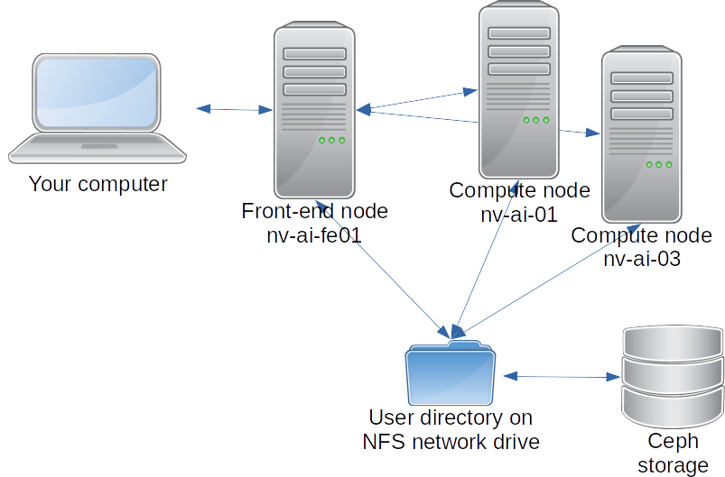
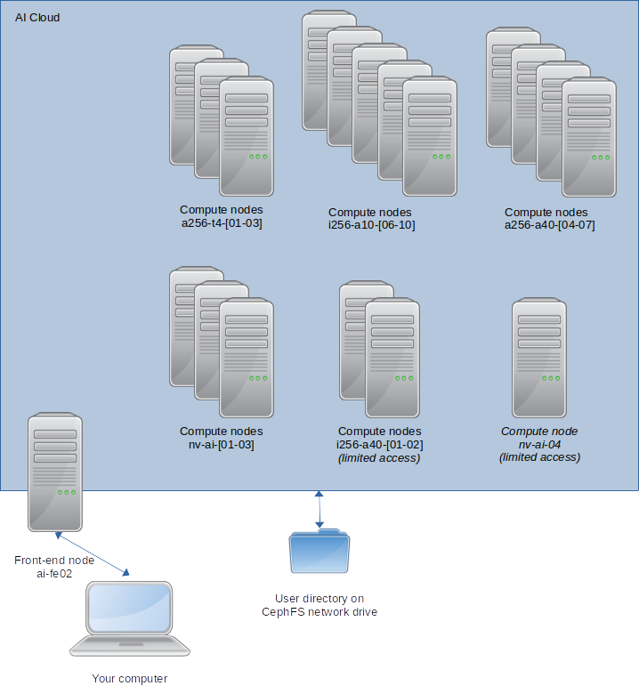

# AI Cloud structure

The AI Cloud currently consists of two separate platforms: the [AI
Cloud pilot platform](#ai-cloud-pilot-platform) and the "new" [AI
Cloud](#ai-cloud-new) which will continue as the sole platform in the
near future.

You are always welcome to [contact the CLAAUDIA
team](https://www.claaudia.aau.dk/support-advisory/) for guidance on
how to best use the described platforms.

## AI Cloud pilot platform

The AI Cloud pilot platform is the first generation of the AI Cloud
and has been in service since 2019. The pilot platform consists of a
front-end node (or log-in or gateway node if you will) and two compute
nodes. Most existing users will know this as "the AI Cloud".

The front-end node is used for logging into the platform, accessing
your files, and starting jobs on the compute nodes. The front-end node
is a relatively small server which is *not* meant for performing heavy
computations; only light-weight operations such as transferring files
to and from AI Cloud and defining and launching job scripts.

The details of defining and running jobs is described in the
[introduction](introduction.md).

The single remaining compute node nv-ai-03 is an [NVIDIA DGX-2
server](https://www.nvidia.com/en-us/data-center/dgx-2/). The
compute node is equipped with 2 &times; 24-core Intel Xeon CPUs, 1.5 TB of
system RAM, and 16 [NVIDIA Tesla V100
GPUs](https://www.nvidia.com/en-us/data-center/v100/) with 32 GB of
RAM each, all connected via NVIDIA NVLink.  
This is a very powerful server which you can use smaller or larger
portions of for shorter or longer duration. Details on how can be
found in the [introduction](introduction.md).

???+ note

    In the future, the AI Cloud pilot platform will be
    decomissioned and its compute node included in the (new) AI
    Cloud described below.

## AI Cloud (new)

The (new) AI Cloud is the second generation of the AI Cloud which has
gradually been put into service since 2021.  
Like the the pilot platform, the AI Cloud consists of a front-end node
and a number of compute nodes. In contrast to the AI Cloud pilot
platform, the newer AI Cloud is a heterogeneous platform with several
different types of hardware available in the compute nodes.

The compute nodes of the AI Cloud currently include:

- Three compute nodes named a256-t4-01 to a256-t4-03; each with AMD
  CPUs (2 &times; AMD EPYC 7302 16-core), 256GB of system RAM, and 6 [NVIDIA
  T4 GPUs](https://www.nvidia.com/en-us/data-center/tesla-t4/) (16 GB
  of RAM each).
- Five compute nodes named i256-a10-06 to i256-a10-06; each with Intel
  CPUs (2 &times; Xeon Gold 6326), 256GB of system RAM, and 4 [NVIDIA
  A10
  GPUs](https://www.nvidia.com/en-us/data-center/products/a10-gpu/)
  (24 GB of RAM each).
- One [NVIDIA DGX-2
server](https://www.nvidia.com/en-us/data-center/dgx-2/) server named
nv-ai-01; identical to nv-ai-03 above.
- One [NVIDIA
  DGX-A100](https://www.nvidia.com/en-us/data-center/dgx-a100/) server
  named nv-ai-04. This compute node is equipped with AMD CPUs (2 &times; AMD
  Rome 7742 64-core), 2TB of system RAM, and 8 [NVIDIA A100
  GPUs](https://www.nvidia.com/en-us/data-center/a100/) (40GB of RAM
  each).
- In the future, the newer AI Cloud will also contain the compute
  node nv-ai-03 from the AI Cloud pilot platform.
  
!!! important

    Special conditions apply for using the compute node nv-ai-04; see
    [introduction](introduction.md).

This more diverse selection (compared to the pilot platform) of
different hardware in the AI Cloud allows for more suitable choice of
specific hardware according to your task. For example, the DGX-2
compute nodes of the AI Cloud pilot platform are better suited for the
comutationally intensive training of deep neural networks, while the
compute nodes with T4 GPUs are better suited for inference tasks using
an already trained model.

## Operating system, file storage, and application framework

The AI Cloud (and -pilot platform) is based on [Ubuntu
Linux](https://en.wikipedia.org/wiki/Ubuntu) as its operating
system. In practice, working in the AI Cloud primarily takes place via
a [command-line
interface](https://en.wikipedia.org/wiki/Command-line_interface).

Two major building blocks are essential to working with the AI Cloud:
a resource management / queuing system called Slurm and a container
system called Singularity/Apptainer.

???+ info

    The container system formerly known as Singularity [has changed name
    to
    Apptainer](http://apptainer.org/news/community-announcement-20211130). So
    far, the AI Cloud and AI Cloud pilot platform are still using a
    version by the name Singularity. It is likely that this will change
    to Apptainer in the future. So far, we refer to the product as
    Singularity/Apptainer or simply Singularity in the documentation. If
    or when we eventully switch to a version by the Apptainer name, the
    documentation will be updated accordingly.

### Slurm

Slurm is a queueing system that manages resource sharing in the AI
Cloud. Slurm makes sure that all users get a fair share of the
resources and get served in turn. Computational work in the AI Cloud
can *only* be carried out through Slurm. This means you can only run
your jobs on the compute nodes by submitting them to the Slurm
queueing system. It is also through Slurm that you request the amount
of ressources your job requires, such as amount of RAM, number of CPUs
(logical CPUs with hyperthreading = 2 &times; physical CPUs = 2
&times; cores), number of GPUs etc.  
See how to get started with Slurm in the
[introduction](introduction.md).

### Singularity/Apptainer

Singularity is a container framework which serves to provide you with
the necessary software environment to run your computational
workloads. Different researchers may have widely different software
stacks or perhaps versions of the same software stack that you need
for your work. In order to provide maximum flexibility to you as users
and to minimise potential compatibility problems between different
software installed on the compute nodes, each user's software
environment(s) is defined and provisioned as Singularity
containers. You can both download pre-defined container images or
configure or modify them yourself according to your needs.  
See details on container images from NGC in the
[introduction](introduction.md).

### File storage

Both the AI Cloud pilot platform and the newer AI Cloud store your
files in your user directory. Your user directory is stored on a
network file system that allows all of the nodes within each platform
can access your files. This means that if you store or edit a file in
your user directory on the front-end node, the compute nodes in the
same platform can see the same file and contents thereof. The nodes
access the network file system in a shared manner, so there is nothing
you need to do to synchronise the files between the nodes.

The AI Cloud pilot platform and the newer AI Cloud use separate
network file systems. This means that on the AI Cloud pilot platform,
you cannot directly see the files in the newer AI Cloud and vice
versa. You can, however, copy files between them manually; please see
[Introduction; transferring files](introduction.md#transferring-files).
